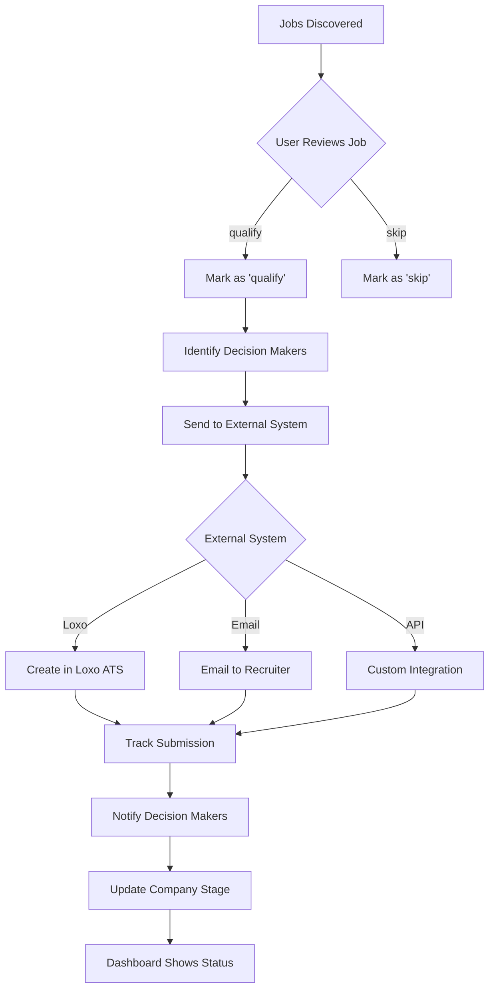

# Customer Flow & Data Model Analysis

**Date:** October 26, 2025  
**Analyst:** AI Assistant  
**Purpose:** Analyze job qualification workflow and recommend optimal data structure for companies and decision makers

---

## 📋 Executive Summary

**Current State:**

- ✅ You have **separate tables** for `companies` and `people` (decision makers)
- ✅ This follows **industry best practices** (HubSpot, Salesforce model)
- ⚠️ Job qualification workflow exists but **lacks external integration**
- ⚠️ Decision maker tracking is **implicit**, not explicit

**Recommendation:**

- ✅ **KEEP separate tables** (companies + people)
- ✅ **ADD association labels** to mark decision makers
- ✅ **IMPLEMENT external integration** for qualified jobs
- ✅ **ENHANCE workflow** with decision maker notifications

---

## 🔍 Industry Best Practices Research

### 1. **HubSpot Data Model** (Market Leader)

**Structure:**

```
Companies (Organizations)
  ↓
Contacts (People) → Associated to companies
  ↓
Deals/Opportunities
```

**Key Features:**

- Separate `companies` and `contacts` tables
- **Association labels** (e.g., "Primary Contact", "Decision Maker", "Billing Contact")
- Many-to-many relationships (one person can work at multiple companies)
- Automatic domain-based association

**Source:** HubSpot uses flexible association model where contacts can be linked to multiple companies with labeled relationships.

---

### 2. **Salesforce Data Model** (Enterprise Standard)

**Structure:**

```
Accounts (Companies)
  ↓
Contacts (People) → Related to accounts
  ↓
Opportunities (Deals)
```

**Key Features:**

- Normalized database design
- Separate `Account` and `Contact` objects
- Lookup relationships with roles (e.g., "Decision Maker", "Economic Buyer")
- Contact Roles on Opportunities

**Difference from HubSpot:**

- More rigid structure (primary account per contact)
- Better for complex enterprise hierarchies

---

### 3. **Recruitment ATS Best Practices**

**Structure:**

```
Companies (Clients)
  ↓
Jobs (Openings)
  ↓
Candidates (Applicants)
  ↑
Contacts (Decision Makers at Companies)
```

**Key Features:**

- Companies separate from contacts
- Jobs linked to companies
- Decision makers tracked as contacts with roles
- Many-to-many: Multiple decision makers per company

**Source:** Industry standard for recruitment platforms (Lever, Greenhouse, Workable)

---

## 📊 Your Current Data Model Analysis

### **Current Schema:**

```sql
┌─────────────┐         ┌──────────┐         ┌──────────┐
│ companies   │◄────────│  jobs    │         │  people  │
├─────────────┤         ├──────────┤         ├──────────┤
│ id          │         │ id       │         │ id       │
│ name        │         │ title    │    ┌────│ company_id
│ industry    │         │ company_id    │    │ name     │
│ website     │         │ location │    │    │ email    │
│ owner_id    │         │ qualification_status│ company_role
│ loxo_company_id       │ qualified│    │    │ people_stage
│ pipeline_stage        │ qualified_by  │    │ owner_id │
└─────────────┘         └──────────┘    │    └──────────┘
                                        │
                                        └────Many people
                                             per company
```

**Relationships:**

- `jobs.company_id` → `companies.id` (many-to-one)
- `people.company_id` → `companies.id` (many-to-one)
- `companies.loxo_company_id` → External system reference

---

## 🔄 Current Customer Flow Analysis

### **Your Stated Workflow:**

> "Qualify the jobs → Send off externally → Update decision makers in the company"

### **Current Implementation:**

1. **Jobs Discovery** → Jobs appear in system (new)
2. **Qualification** → User changes `qualification_status`:
   - `new` → Unreviewed
   - `qualify` → Approved for pursuit
   - `skip` → Not pursuing
3. **❌ Missing:** External send-off mechanism
4. **❌ Missing:** Decision maker notification/update
5. **❌ Missing:** Workflow automation

---

## 🎯 Recommended Solution

### **Option 1: Keep Separate Tables + Association Labels** ⭐ **RECOMMENDED**

**Why This is Best:**

✅ **Industry Standard** - Follows HubSpot/Salesforce patterns  
✅ **Scalability** - Handles complex relationships  
✅ **Flexibility** - One person can have multiple roles  
✅ **Data Integrity** - No duplication  
✅ **Query Performance** - Optimized with proper indexes

**Implementation:**

```sql
-- Your current tables (KEEP AS IS)
companies (
  id uuid PRIMARY KEY,
  name text,
  industry text,
  loxo_company_id text, -- External system ID
  ...
)

people (
  id uuid PRIMARY KEY,
  name text,
  email_address text,
  company_id uuid REFERENCES companies(id),
  company_role text, -- "Sales Manager", "VP Engineering"
  people_stage text, -- new/qualified/proceed/skip
  ...
)

-- NEW: Association Labels Table
CREATE TABLE company_contact_associations (
  id uuid PRIMARY KEY DEFAULT gen_random_uuid(),
  company_id uuid REFERENCES companies(id) ON DELETE CASCADE,
  person_id uuid REFERENCES people(id) ON DELETE CASCADE,
  association_label text NOT NULL, -- 'decision_maker', 'hiring_manager', 'primary_contact'
  is_primary boolean DEFAULT false,
  created_at timestamp DEFAULT now(),
  updated_at timestamp DEFAULT now(),

  UNIQUE(company_id, person_id, association_label)
);

CREATE INDEX idx_associations_company ON company_contact_associations(company_id);
CREATE INDEX idx_associations_person ON company_contact_associations(person_id);
CREATE INDEX idx_associations_label ON company_contact_associations(association_label);

-- NEW: Job External Submissions (for tracking external sends)
CREATE TABLE job_external_submissions (
  id uuid PRIMARY KEY DEFAULT gen_random_uuid(),
  job_id uuid REFERENCES jobs(id) ON DELETE CASCADE,
  external_system text NOT NULL, -- 'loxo', 'bullhorn', 'email'
  external_id text, -- ID in external system
  submitted_at timestamp DEFAULT now(),
  submitted_by uuid REFERENCES user_profiles(id),
  status text DEFAULT 'pending', -- pending/sent/failed
  response_data jsonb,
  error_message text,

  UNIQUE(job_id, external_system)
);

-- NEW: Decision Maker Notifications
CREATE TABLE decision_maker_notifications (
  id uuid PRIMARY KEY DEFAULT gen_random_uuid(),
  job_id uuid REFERENCES jobs(id) ON DELETE CASCADE,
  person_id uuid REFERENCES people(id) ON DELETE CASCADE,
  company_id uuid REFERENCES companies(id) ON DELETE CASCADE,
  notification_type text NOT NULL, -- 'job_qualified', 'job_submitted', 'job_matched'
  notification_channel text, -- 'email', 'in_app', 'sms'
  sent_at timestamp,
  read_at timestamp,
  metadata jsonb,
  created_at timestamp DEFAULT now()
);
```

---

## 🔄 Enhanced Customer Flow (Recommended)



**Step-by-Step Flow:**

1. **Job Qualification** (Existing)
   - User reviews job
   - Changes `qualification_status` to `'qualify'`
   - Optionally adds `qualification_notes`

2. **Decision Maker Identification** (NEW)
   - Query people associated with company
   - Filter by `association_label = 'decision_maker'`
   - Show list for confirmation

3. **External Submission** (NEW)
   - Call external API (Loxo, Bullhorn, etc.)
   - Record submission in `job_external_submissions`
   - Update job status to track submission state

4. **Decision Maker Notification** (NEW)
   - Create notification records
   - Send emails/alerts to decision makers
   - Track opens/clicks

5. **Company Update** (NEW)
   - Update company `pipeline_stage`
   - Log interaction in `interactions` table
   - Update company `updated_at`

---

## 💻 Implementation Code Examples

### **1. Mark Decision Makers**

```typescript
// src/services/decisionMakerService.ts

export async function markAsDecisionMaker(
  personId: string,
  companyId: string,
  isPrimary = false
) {
  const { data, error } = await supabase
    .from('company_contact_associations')
    .upsert({
      company_id: companyId,
      person_id: personId,
      association_label: 'decision_maker',
      is_primary: isPrimary,
      updated_at: new Date().toISOString(),
    });

  if (error) throw error;
  return data;
}

export async function getDecisionMakers(companyId: string) {
  const { data, error } = await supabase
    .from('company_contact_associations')
    .select(
      `
      id,
      is_primary,
      people:person_id (
        id,
        name,
        email_address,
        company_role,
        people_stage
      )
    `
    )
    .eq('company_id', companyId)
    .eq('association_label', 'decision_maker')
    .order('is_primary', { ascending: false });

  if (error) throw error;
  return data;
}
```

---

### **2. Submit Job Externally**

```typescript
// src/services/externalSubmissionService.ts

interface SubmitJobParams {
  jobId: string;
  externalSystem: 'loxo' | 'bullhorn' | 'email';
  recipientEmails?: string[];
  notes?: string;
}

export async function submitJobExternally({
  jobId,
  externalSystem,
  recipientEmails,
  notes,
}: SubmitJobParams) {
  // 1. Fetch job details
  const { data: job, error: jobError } = await supabase
    .from('jobs')
    .select(
      `
      id,
      title,
      location,
      description,
      companies (
        id,
        name,
        industry,
        loxo_company_id
      )
    `
    )
    .eq('id', jobId)
    .single();

  if (jobError) throw jobError;

  let externalId = null;
  let status = 'pending';
  let errorMessage = null;

  try {
    // 2. Submit to external system
    switch (externalSystem) {
      case 'loxo':
        externalId = await submitToLoxo(job);
        status = 'sent';
        break;

      case 'email':
        await emailJobToRecruiters(job, recipientEmails);
        status = 'sent';
        break;

      case 'bullhorn':
        externalId = await submitToBullhorn(job);
        status = 'sent';
        break;
    }
  } catch (error) {
    status = 'failed';
    errorMessage = error.message;
  }

  // 3. Record submission
  const { data: submission, error: submissionError } = await supabase
    .from('job_external_submissions')
    .insert({
      job_id: jobId,
      external_system: externalSystem,
      external_id: externalId,
      status,
      error_message: errorMessage,
      response_data: { notes },
    })
    .select()
    .single();

  if (submissionError) throw submissionError;

  return submission;
}
```

---

### **3. Notify Decision Makers**

```typescript
// src/services/decisionMakerNotificationService.ts

export async function notifyDecisionMakers(
  jobId: string,
  notificationType: 'job_qualified' | 'job_submitted' | 'job_matched'
) {
  // 1. Get job and company
  const { data: job } = await supabase
    .from('jobs')
    .select('id, title, company_id')
    .eq('id', jobId)
    .single();

  if (!job) throw new Error('Job not found');

  // 2. Get decision makers for this company
  const { data: associations } = await supabase
    .from('company_contact_associations')
    .select(
      `
      person_id,
      people:person_id (
        id,
        name,
        email_address
      )
    `
    )
    .eq('company_id', job.company_id)
    .eq('association_label', 'decision_maker');

  if (!associations || associations.length === 0) {
    console.log('No decision makers found for company');
    return [];
  }

  // 3. Create notification records
  const notifications = associations.map(assoc => ({
    job_id: jobId,
    person_id: assoc.person_id,
    company_id: job.company_id,
    notification_type: notificationType,
    notification_channel: 'email',
    metadata: {
      job_title: job.title,
    },
  }));

  const { data, error } = await supabase
    .from('decision_maker_notifications')
    .insert(notifications)
    .select();

  if (error) throw error;

  // 4. Send actual emails (async)
  for (const assoc of associations) {
    await sendDecisionMakerEmail(
      assoc.people.email_address,
      assoc.people.name,
      job.title,
      notificationType
    );
  }

  return data;
}
```

---

### **4. Complete Qualification Workflow**

```typescript
// src/services/jobQualificationWorkflow.ts

export async function completeJobQualification(
  jobId: string,
  options: {
    sendToExternal?: boolean;
    externalSystem?: 'loxo' | 'email';
    notifyDecisionMakers?: boolean;
  } = {}
) {
  const {
    sendToExternal = true,
    externalSystem = 'loxo',
    notifyDecisionMakers = true,
  } = options;

  // 1. Update job status
  await supabase
    .from('jobs')
    .update({
      qualification_status: 'qualify',
      qualified: true,
      qualified_at: new Date().toISOString(),
      qualified_by: (await supabase.auth.getUser()).data.user?.id,
    })
    .eq('id', jobId);

  // 2. Submit externally
  let submission = null;
  if (sendToExternal) {
    submission = await submitJobExternally({
      jobId,
      externalSystem,
    });
  }

  // 3. Notify decision makers
  if (notifyDecisionMakers) {
    await notifyDecisionMakers(jobId, 'job_qualified');
  }

  // 4. Update company stage
  const { data: job } = await supabase
    .from('jobs')
    .select('company_id')
    .eq('id', jobId)
    .single();

  if (job?.company_id) {
    await supabase
      .from('companies')
      .update({
        pipeline_stage: 'engaged',
        updated_at: new Date().toISOString(),
      })
      .eq('id', job.company_id);
  }

  return {
    jobUpdated: true,
    externalSubmission: submission,
    notificationsSent: notifyDecisionMakers,
  };
}
```

---

## 🎨 UI Components Needed

### **1. Decision Maker Selector**

```typescript
// src/components/jobs/DecisionMakerSelector.tsx

interface DecisionMakerSelectorProps {
  companyId: string;
  onSelect: (personIds: string[]) => void;
}

export function DecisionMakerSelector({ companyId, onSelect }: DecisionMakerSelectorProps) {
  const [people, setPeople] = useState([]);
  const [selectedIds, setSelectedIds] = useState<string[]>([]);

  useEffect(() => {
    loadDecisionMakers();
  }, [companyId]);

  const loadDecisionMakers = async () => {
    const { data } = await supabase
      .from('company_contact_associations')
      .select(`
        people:person_id (
          id,
          name,
          email_address,
          company_role
        )
      `)
      .eq('company_id', companyId)
      .eq('association_label', 'decision_maker');

    setPeople(data?.map(d => d.people) || []);
  };

  return (
    <div className="space-y-2">
      <Label>Decision Makers to Notify</Label>
      {people.map(person => (
        <div key={person.id} className="flex items-center gap-2">
          <Checkbox
            checked={selectedIds.includes(person.id)}
            onCheckedChange={checked => {
              if (checked) {
                setSelectedIds([...selectedIds, person.id]);
              } else {
                setSelectedIds(selectedIds.filter(id => id !== person.id));
              }
            }}
          />
          <span>{person.name} - {person.company_role}</span>
        </div>
      ))}
      <Button onClick={() => onSelect(selectedIds)}>
        Confirm Selection
      </Button>
    </div>
  );
}
```

---

### **2. Job Qualification Action**

```typescript
// src/components/jobs/JobQualificationAction.tsx

export function JobQualificationAction({ job }: { job: Job }) {
  const [showDialog, setShowDialog] = useState(false);
  const [externalSystem, setExternalSystem] = useState<'loxo' | 'email'>('loxo');

  const handleQualify = async () => {
    await completeJobQualification(job.id, {
      sendToExternal: true,
      externalSystem,
      notifyDecisionMakers: true,
    });

    toast.success('Job qualified and submitted successfully');
    setShowDialog(false);
  };

  return (
    <>
      <Button onClick={() => setShowDialog(true)}>
        Qualify & Submit
      </Button>

      <Dialog open={showDialog} onOpenChange={setShowDialog}>
        <DialogContent>
          <DialogHeader>
            <DialogTitle>Qualify Job: {job.title}</DialogTitle>
          </DialogHeader>

          <div className="space-y-4">
            <div>
              <Label>External System</Label>
              <Select value={externalSystem} onValueChange={setExternalSystem}>
                <SelectTrigger>
                  <SelectValue />
                </SelectTrigger>
                <SelectContent>
                  <SelectItem value="loxo">Loxo ATS</SelectItem>
                  <SelectItem value="email">Email to Recruiter</SelectItem>
                </SelectContent>
              </Select>
            </div>

            <DecisionMakerSelector
              companyId={job.company_id}
              onSelect={personIds => console.log('Selected:', personIds)}
            />

            <Button onClick={handleQualify} className="w-full">
              Qualify & Submit
            </Button>
          </div>
        </DialogContent>
      </Dialog>
    </>
  );
}
```

---

## 📊 Comparison: One Table vs. Separate Tables

### **Option A: Combined Table (NOT Recommended)**

```sql
companies_with_contacts (
  id uuid,
  company_name text,
  company_industry text,
  decision_makers jsonb[] -- [{"name": "John", "email": "..."}]
)
```

**Cons:**

- ❌ **Data duplication** if person works at multiple companies
- ❌ **Query complexity** (JSON queries are slow)
- ❌ **No referential integrity**
- ❌ **Difficult to track individual person history**
- ❌ **Can't link emails/interactions to specific person**
- ❌ **Violates database normalization principles**

---

### **Option B: Separate Tables (RECOMMENDED)**

```sql
companies (id, name, industry, ...)
people (id, name, email, company_id, ...)
company_contact_associations (company_id, person_id, label)
```

**Pros:**

- ✅ **No data duplication**
- ✅ **Fast queries with indexes**
- ✅ **Referential integrity enforced**
- ✅ **Track individual person across companies**
- ✅ **Link emails/interactions to person**
- ✅ **Industry standard pattern**
- ✅ **Scales to millions of records**

---

## 🎯 Final Recommendation

### **Data Structure: Use Separate Tables** ⭐

**Keep your current structure:**

- ✅ `companies` table (as is)
- ✅ `people` table (as is, with `company_id` FK)

**Add these new tables:**

- ✅ `company_contact_associations` - For decision maker labels
- ✅ `job_external_submissions` - Track external sends
- ✅ `decision_maker_notifications` - Track notifications

---

### **Customer Flow: Implement Enhanced Workflow** ⭐

**Phase 1: Foundation (Week 1)**

1. Create new database tables
2. Add UI to mark decision makers
3. Build external submission service

**Phase 2: Integration (Week 2)**

1. Implement Loxo API integration
2. Build notification system
3. Add workflow automation

**Phase 3: Enhancement (Week 3)**

1. Add email templates
2. Build notification dashboard
3. Add analytics/reporting

---

## 📚 Resources

**Industry Research:**

- HubSpot Association Model: https://knowledge.hubspot.com/object-settings/create-and-use-association-labels
- Salesforce Data Model: https://developer.salesforce.com/docs/atlas.en-us.object_reference.meta/
- ATS Database Design: https://www.red-gate.com/blog/designing-a-database-for-a-recruitment-system

**Your Existing Code:**

- `docs/DATABASE/DATABASE_BEST_PRACTICES.md` - Current schema reference
- `src/integrations/supabase/types.ts` - Type definitions
- `src/pages/Jobs.tsx` - Current job qualification UI

---

## ✅ Action Items

**Immediate:**

1. [ ] Create database migration for new tables
2. [ ] Update TypeScript types
3. [ ] Build decision maker service
4. [ ] Add external submission service

**Short-term:** 5. [ ] Implement Loxo integration (or chosen external system) 6. [ ] Build notification system 7. [ ] Update Jobs.tsx with new workflow 8. [ ] Add decision maker UI components

**Long-term:** 9. [ ] Add analytics dashboard 10. [ ] Build reporting system 11. [ ] Implement advanced automation

---

**Questions or Need Clarification?**

1. Which external system are you using? (Loxo, Bullhorn, custom?)
2. What information should be sent to decision makers?
3. Should decision makers have access to the platform?
4. Do you need approval workflow before external submission?
